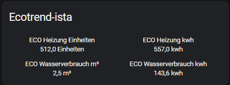

# ecotrend-ista

[ecotrend-ista](https://ecotrend.ista.de/) Home Assistant Integration

[](https://github.com/hacs/integration)
[](https://github.com/Ludy87/ecotrend-ista/releases)

[](LICENSE)
[](https://github.com/Ludy87/ecotrend-ista/issues)
[](https://github.com/Ludy87/ecotrend-ista/actions/workflows/hassfest.yaml)


## Installation

### MANUAL INSTALLATION

Copy the ecotrend_ista [last Releae](https://github.com/Ludy87/ecotrend-ista/releases) folder and all of its contents into your Home Assistant's custom_components folder. This folder is usually inside your /config folder. If you are running Hass.io, use SAMBA to copy the folder over. If you are running Home Assistant Supervised, the custom_components folder might be located at /usr/share/hassio/homeassistant. You may need to create the custom_components folder and then copy the localtuya folder and all of its contents into it Alternatively, you can install localtuya through HACS by adding this repository.

### INSTALLATION mit HACS

1. Ensure that [HACS](https://hacs.xyz/) is installed.
2. Search for and install the "**ecotrend ista Integration**" integration. [](https://github.com/Ludy87/ecotrend-ista/releases)
3. [Add a `ecotrend_ista` entry to your `configuration.yaml`.](https://github.com/Ludy87/ecotrend-ista#basis-configuration)
4. Restart Home Assistant.

---

## Basis Configuration

Add entry to your `configuration.yaml`

```yaml
ecotrend_ista:
  email: "email@local"
  password: "password"
```

### optional

```yaml
unit_heating: "Einheiten"  # default kwh
unit_warmwater: "m³"  # default kwh
```

```yaml
year:
  - 2022
yearmonth:
  - "2022.4"
```

```yaml
scan_interval: 39600
```
---
### deprecated v1.0.7-beta-3

```yaml
unit: "kwh"
```
---

## Template

```yaml
- template:
    - sensor:
        - name: ECO Heizung Einheiten
          unit_of_measurement: "Einheiten"
          state: "{{ state_attr('sensor.heating_XXXXXXXXX', 'value') }}"
          state_class: total
        - name: ECO Heizung kwh
          unit_of_measurement: "kwh"
          state: "{{ state_attr('sensor.heating_XXXXXXXXX', 'valuekwh') }}"
          state_class: total
        - name: ECO Wasserverbrauch m³
          unit_of_measurement: "m³"
          state: "{{ state_attr('sensor.warmwater_XXXXXXXXX', 'value') }}"
          state_class: total
        - name: ECO Wasserverbrauch kwh
          unit_of_measurement: "kwh"
          state: "{{ state_attr('sensor.warmwater_XXXXXXXXX', 'valuekwh') }}"
          state_class: total
        - name: ECO Heizung Einheiten 03/2022
          unit_of_measurement: "Einheiten"
          state: "{{ state_attr('sensor.heating_2022_3_XXXXXXXXX', 'value') }}"
          state_class: total
        - name: ECO Heizung kwh 03/2022
          unit_of_measurement: "kwh"
          state: "{{ state_attr('sensor.heating_2022_3_XXXXXXXXX', 'valuekwh') }}"
          state_class: total
        - name: ECO Wasserverbrauch m³ 03/2022
          unit_of_measurement: "m³"
          state: "{{ state_attr('sensor.warmwater_2022_3_XXXXXXXXX', 'value') }}"
          state_class: total
        - name: ECO Wasserverbrauch kwh 03/2022
          unit_of_measurement: "kwh"
          state: "{{ state_attr('sensor.warmwater_2022_3_XXXXXXXXX', 'valuekwh') }}"
          state_class: total
```



# Debug

```yaml
logger:
  logs:
    custom_components.ecotrend_ista: debug
```

---
