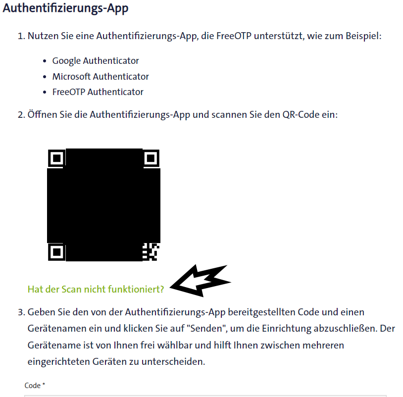

# Two-factor authentication

## Steps

### aktivier debugging <https://github.com/Ludy87/ecotrend-ista#debug>

### Gehe zu <https://ecotrend.ista.de/> und logge dich ein. Danach auf Menü, wähle "Benutzerkonto" und scrolle zu "Zwei-Stufen-Authentifizierung" und klicke auf "Hinzufügen"


### Klicke auf "Hat der Scan nicht funktioniert?" unter dem QR-Code



### Bei Punkt 2 wird der Schlüssel angezeigt der kopiert werden muss (am besten aufschreiben wird zweimal benötigt)


### erstell nun einen OTP Sensor in Home-Assistant und startet Home-Assistant neu

<https://www.home-assistant.io/integrations/otp#configuration>

```yaml
# Example configuration.yaml entry
sensor:
  - platform: otp
    token: KEY_FROM_ECOTREND
```

### Schreibe einen Namen in "Gerätename" bevor du den Code von OTP Sensor kopierst, danach kopierst du den generierten Code und fügst ihn ein (Achtung, der Code ist nur 30sec gültig)


### Jetzt kann die Integration [](https://my.home-assistant.io/redirect/hacs_repository/?owner=Ludy87&repository=ecotrend-ista&category=integration) angelegt werden

### gebe die Daten ein


### Sollte etwas nicht funktionieren, lassen sie 30 minuten vergehen, bis sie es wiederholen - Ista hat eine Bruceforce detektion
