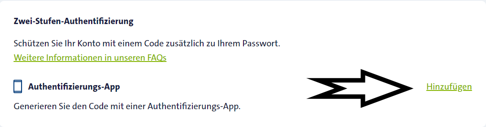
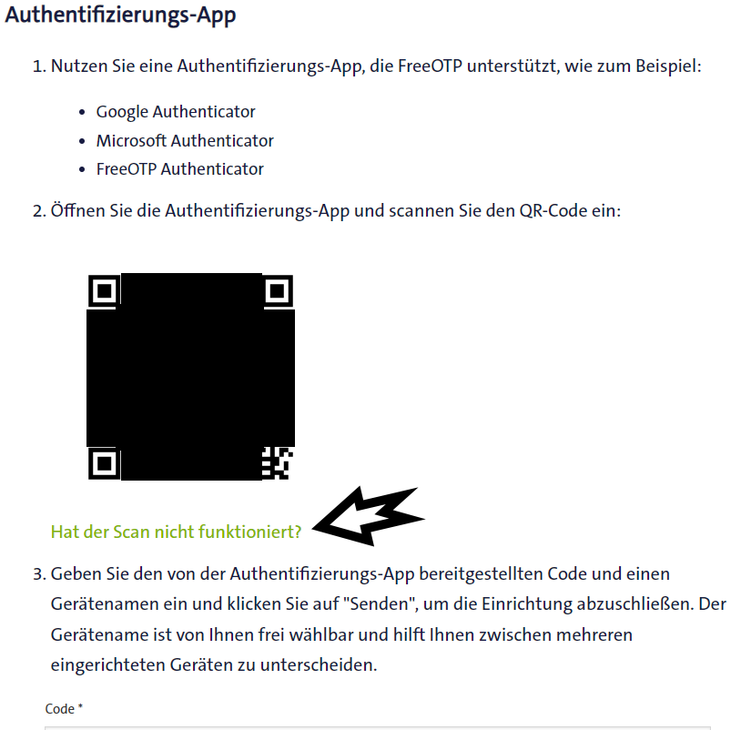
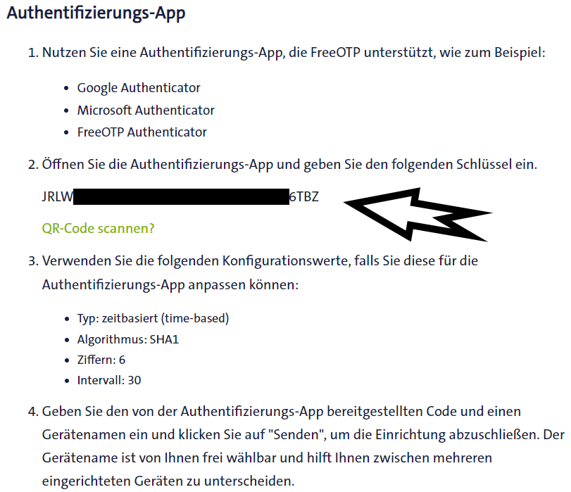
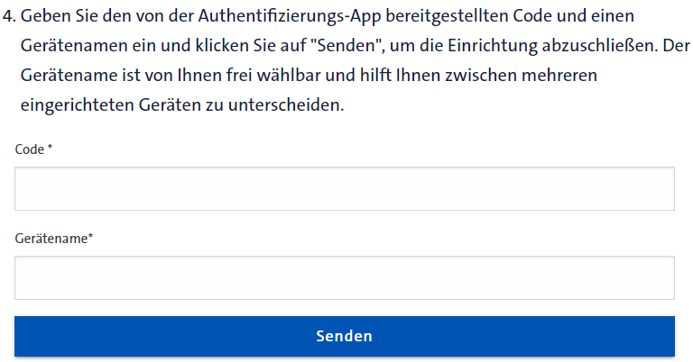
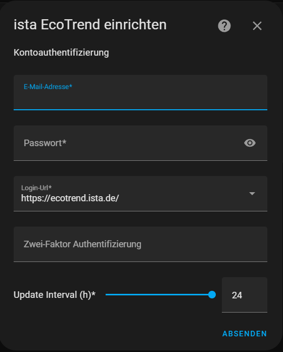

# Two-factor authentication

## Steps

### enable debugging <https://github.com/Ludy87/ecotrend-ista#debug>

### Go to <https://ecotrend.ista.de/>  and log in. After that, click on the menu, select "Benutzerkonto" and scroll down to "Zwei-Stufen-Authentifizierung" then click on "Hinzufügen"



### Click on "Hat der Scan nicht funktioniert?" below the QR code



### In step 2, the key will be displayed, which needs to be copied (it's best to write it down, as it will be required twice)



### Now create an OTP sensor in Home-Assistant and restart Home-Assistant

<https://www.home-assistant.io/integrations/otp#configuration>

```yaml
# Example configuration.yaml entry
sensor:
  - platform: otp
    token: KEY_FROM_ECOTREND
```

### Write a name in the "Gerätename" before copying the code from the OTP sensor; then, paste the generated code (Note: the code is only valid for 30 seconds)



### Now the integration can be set up [](https://my.home-assistant.io/redirect/hacs_repository/?owner=Ludy87&repository=ecotrend-ista&category=integration)

### Enter the data



### If something doesn't work, wait for 30 minutes before trying again - Ista has a brute force detection
